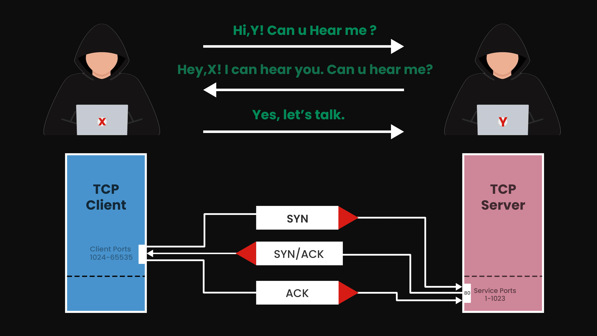

# **Understanding Network Scanning:**

+ ### **What is Network Scanning?**

Network scanning is a critical process used to gather essential information about a network and its associated services. This process involves actively communicating with the target system to identify key components such as IP addresses and hostnames, open ports, and the specific services running on those ports. By systematically scanning the network, security professionals can pinpoint live hosts and detect vulnerable services that may be exposed to potential threats. Understanding these aspects is vital for assessing the security posture of the network and implementing effective measures to protect it from unauthorized access and attacks.

+ ### **Types of Scanning**

Different scanning methods are used to find hosts, ports, and services in a target network. Some of the most common scanning techniques are well-known for their effectiveness. Each method has its own strengths, helping security experts choose the best way to analyze a network based on their specific needs.

+ ### **Network Scanning**

During network scanning, attackers create a list of active IP addresses of computers on the target network. By understanding the layout of the network and the services running on each computer, attackers can more easily identify potential weaknesses to exploit.

+ ### **List of Network Scanners**

  + [Angry IP Scanner](https://github.com/angryip/ipscan)
  + [Advanced IP Scanner](https://bjansen.github.io/scoop-apps/extras/advanced-ip-scanner/)
  + [Netdiscover](https://github.com/netdiscover-scanner/netdiscover)
  + [Nmap](https://github.com/nmap/nmap)
  + [Autoscan](https://github.com/darksh3llgr/autoscan)
  + [hping3](https://github.com/HiddenShot/Hping3)

+ ### **List of Network Scanning Methods**

  + Ping Sweep
  + ARP Scan

+ ### ** What are `Ports` & `Port Numbers` ?**

Ports are like virtual doorways on a digital device that allow it to communicate with other devices. Each device can have up to 65,535 ports, each identified by a unique number ranging from 0 to 65,535. These ports enable different types of communication, like sending emails or browsing the web, making it possible for devices to share information and work together.

  |Ports         |       About        |
  |--------------|--------------------|
  | 0-1023       | Well-known Ports   |
  | 1024-49135   | Registered Ports   |
  | 49136-65535  | Dynamic Ports      |

+ ### **What is port Scanning?**

Port scanning is a method where an attacker sends small test messages to a target to see how it reacts. Based on the responses, the attacker can figure out which ports are open, what services are running on those ports, and even the operating system the target is using.

+ ### **List of Port Scanners**

  + Nmap
  + Zenmap
  + Strobe
  + SuperScan

+ ### **List of Port Scanning Methods**

  + SYN Scan/Stealth Scan
  + TCP Connect Scan
  + ACK Scan
  + XMAS Scan
  + FIN Scan
  + NULL Scan 
  + OS Detection Scan 
  + Script Scan 
  + UDP Scan 
  + Service Detection Scan

+ ### **Some Well Known Ports**

|     **TCP Protocol**           |                                |               |  **UDP Protocol**    |
|--------------------------------|--------------------------------|---------------|----------------------|
| Application                    | Port Number(s)                 | Application   | Port Number(s)       |
| FTP                            | 20-21                          | DNS           | 53                   |
| Telnet                         | 23                             | DHCP          | 67,68                |
| SMTP                           | 25                             | TFTP          | 69                   | 
| HTTP                           | 80                             | SNMP          | 161                  |   
| POP3                           | 110                            | IRC           | 194                  |   
| HTTPS                          | 443                            |               |                      |   
| SSH                            | 22                             |               |                      |  
| NetBIOS                        | 139                            |               |                      |   
| SQL                            | 156                            |               |                      |   
| SMB                            | 139, 445                       |               |                      |   
| IMAP                           | 143                            |               |                      |   

For details on other port numbers and services [click here](https://en.wikipedia.org/wiki/List_of_TCP_and_UDP_port_numbers)
 

+ ### **Live Host Identification Scan**

  Live Host Identification Scan is the process of finding active or powered-on computers in a network by sending special packets, like ICMP (ping) or ARP requests, to see which devices respond. This helps in       identifying which computers or devices are currently online in the network.

+ ### **ICMP**

ICMP stands for Internet Control Messaging Protocol, and it's commonly used to help troubleshoot network issues or detect errors with internet connections. ICMP works by sending packets to a target device and checking whether those packets are successfully received or not, which helps in identifying problems with network communication.

+ ### **TCP**

Transmission Control Protocol (TCP) is one of the most commonly used methods for sending data over a network. TCP makes sure that a reliable connection is set up between two devices (like computers) before any data is sent. This ensures the data reaches its destination without any errors. TCP is known as a "connection-oriented" protocol because it checks that both the sender and receiver are ready to communicate before sending anything. It also has built-in error-checking and flow control to ensure data is sent in the correct order and any lost packets are resent.

+ ### **UDP**

UDP, or User Datagram Protocol, is a method for sending data over a network that doesn't require a direct connection between devices. Unlike TCP, UDP is "connectionless," meaning it doesn't check if the other device is ready before sending data. This makes it faster, but it can result in some data loss. UDP is often used for things like online video and voice calls, where losing a little bit of data doesn't cause major problems. It also doesn't have built-in error checking or flow control, which is why it’s faster but less reliable than TCP.

+ ### **TCP 3 Way Handshake**

To start a proper TCP connection, the sender and receiver go through a process called a "3-way handshake" before sharing data. This handshake helps both devices agree on how they will communicate. It ensures that both sides are ready to exchange data reliably. The 3-way handshake involves three steps between the two devices to confirm the connection is established and working properly. The image below shows how this process works.

